&nbsp;
&nbsp;

## `🛰️ $ whoami`

  

Software engineering student building **production-shaped systems** — REST APIs, offline-sync platforms and hardware-connected apps — focused on backend architecture, data integrity and clean design.

## `🪐 $ cat stack.system`

  

## `🚀 $ ls missions/ --featured`

<table>
  <tr>
    <td width="50%" valign="top">
      <code>◉ MISSION 01 · quingeo-hce/</code>  
      <b>🩺 Quingeo HCE</b> 
      Clinical records system built for unreliable connectivity — it has to stay usable when the network drops mid-consultation.  
      <code>objective</code> offline-first EHR that never loses a record 
      <code>outcome&nbsp;&nbsp;</code> auto-sync on reconnect · JWT-hardened · documented C4 architecture  
       
      <code>React · TypeScript · Spring Boot · MySQL · IndexedDB</code>  
      <code>status: ● deployed</code>
    </td>
    <td width="50%" valign="top">
      <code>◉ MISSION 02 · hidrobyte/</code>  
      <b>💧 HidroByte</b> 
      Effortless hydration tracking — no manual logging, tied to real physical intake.  
      <code>objective</code> measure what you actually drink, automatically 
      <code>outcome&nbsp;&nbsp;</code> Android app + Arduino sensor · daily/monthly/yearly stats · reminders  
       
      <code>Kotlin · Android · Arduino</code>  
      <code>status: ● operational</code>
    </td>
  </tr>
</table>

## `📡 $ ping --open-channel`

**Open to freelance contracts and full-time opportunities.** 
Got a mission that needs a solid backend? Send a signal.

 

 

  

